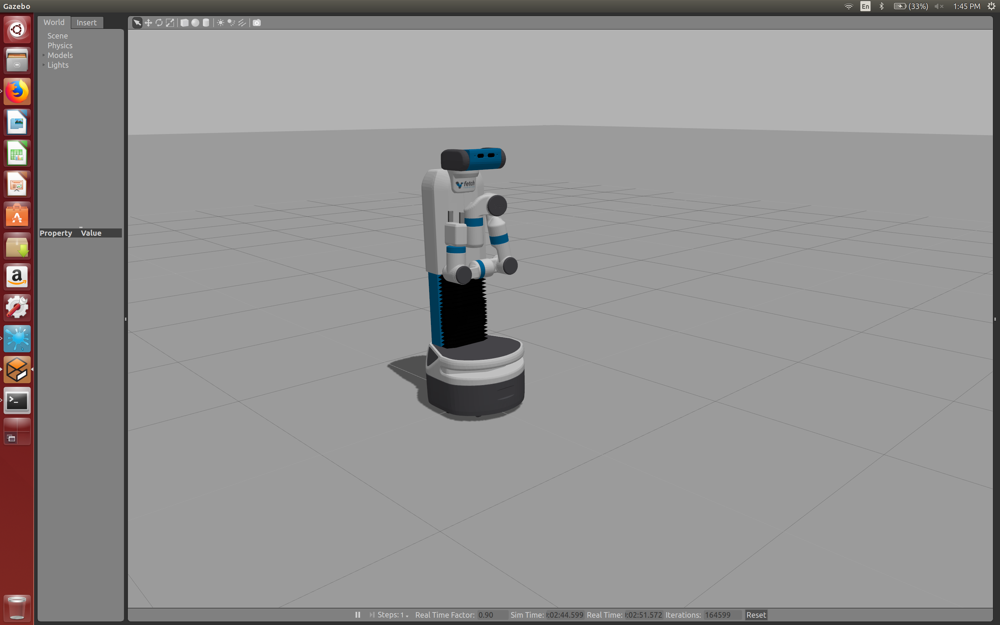
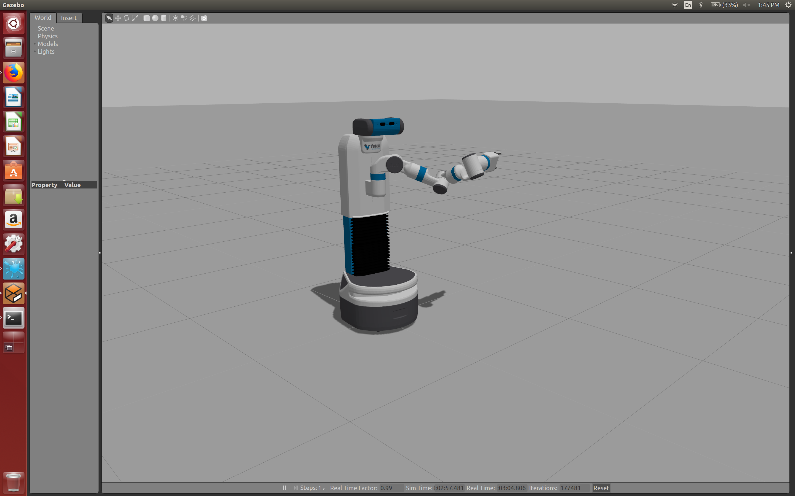
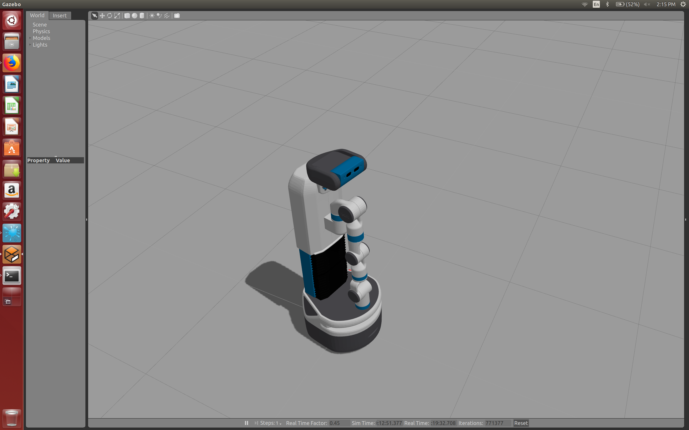

# Arm

Now let's move the robot's arms!

## Fetch: Background, Code

These use an action interface with a `control_msgs/FollowJointTrajectory`
action, like the torso and head. (Well, for the head, using the pan tilt method,
not the "look at an (x,y,z) coordinate" strategy.) So again, we specify a
trajectory to follow. 

Unlike the torso and head code, the code (for the arm, at least) uses the MoveIt
library, presumably due to the increase complexity of the motions, as we're
specifying seven joints, not one (torso) or two (head).

We have these *action interfaces*:

- `arm_controller/follow_joint_trajectory` to control just the seven joints of
  the arm.
- `arm_with_torso_controller/follow_joint_trajectory` to control the seven
  joints of the arm plus the torso.
- `torso_controller/follow_joint_trajectory` to control just the torso.

I did the torso one elsewhere,and I don't think we need to adjust both the arm
and torso together. Let's just focus on the first action interface.

Fortunately, Justin Huang [wrote some stuff on his Wiki][1] to clarify the arm
code, Lab 7.

[See also the Lab 19 documentation][2], which is the one that introduces MoveIt
and *Cartesian space* manipulation, as compared to *joint space* manipulation.
It's easier to think of (x,y,z) positions of the end-effector, that's why.

> Given the joint angles of the arm, it's easy to compute where the gripper (the
> end-effector) will be, since we know how long the arm links are and how they
> are connected. This is called the forward kinematics of the arm. The inverse
> kinematics (IK) problem is, given the desired end-effector pose, to find out
> what the joint angles should be for the end-effector to achieve that pose.
> This is a harder problem. Sometimes, there are multiple arm configurations
> that result in the same end-effector pose, while other times, the pose is not
> reachable. The way to solve the IK problem depends on what kind of arm you
> have. For some arms (including that of the Fetch), there is a closed-form
> solution that makes it relatively easy to solve IK, but this is not true for
> all arms.

The last sentence above is interesting. Why is there a closed-form solution?

Code:

- `arm.py`, major script which uses MoveIt for motion planning, assuming we want
  Cartesian coordinates. If we know the joint angles, then we don't need MoveIt.
- `arm_joints.py`, utility for managing joints, doesn't actually assign them to
  the robot.
- `moveit_goal_builder.py`, this is UW's interface which supposedly has
  advantages over `moveit_commander` or `moveit_python`.

## Fetch: Disco and Joint Angle Fun

Here's what happens when running the disco code. First, the torso moves up:

Then we move the arm.

Sure, this is cool. It would be nice, though, to be able to get a joint state
reader, so we can read the joints at a time (and not trial and error) but I'll
have to read through those other tutorials.

[The Fetch docs][3] have a picture of the Fetch with the arm extended straight
out, which is what happens when all 7 joints are at 0. Here's an amusing result
when you set the `shoulder_lift_joint` to be its largest value (87 degrees,
according to the docs), while all other values are 0 (so the arm is straight and
the pan joint means the arm is "facing" straight in front of the robot):

Yeah, the simulator's physics are a bit off.

[1]:https://github.com/cse481wi18/cse481wi18/wiki/Lab-7%3A-Controlling-the-arm
[2]:https://github.com/cse481wi18/cse481wi18/wiki/Lab-19%3A-Cartesian-space-manipulation
[3]:http://docs.fetchrobotics.com/robot_hardware.html
