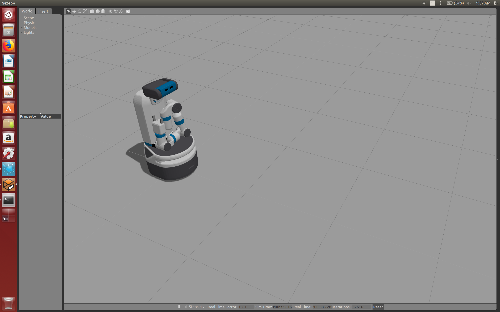
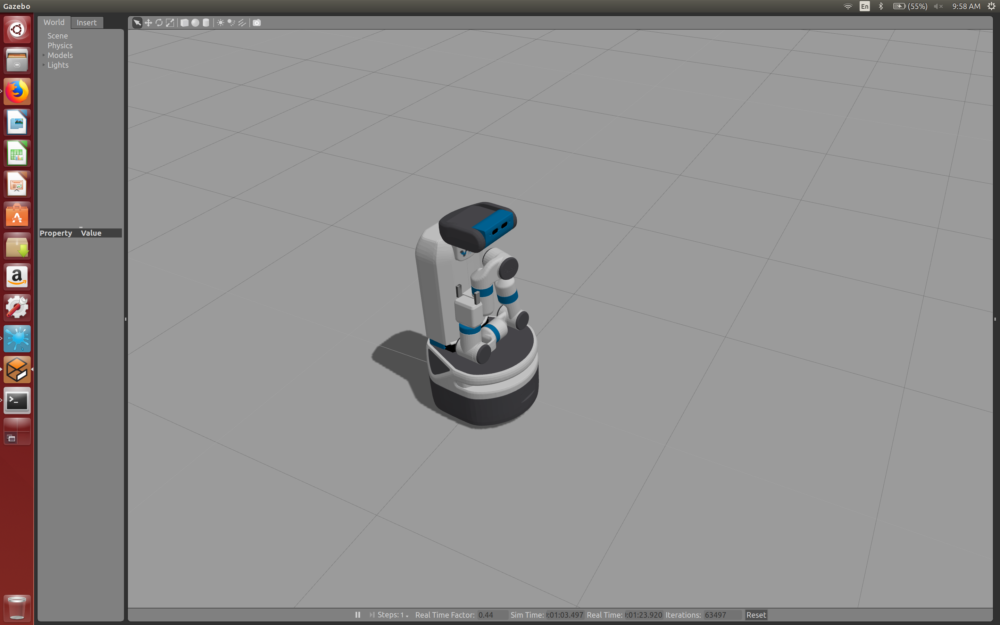
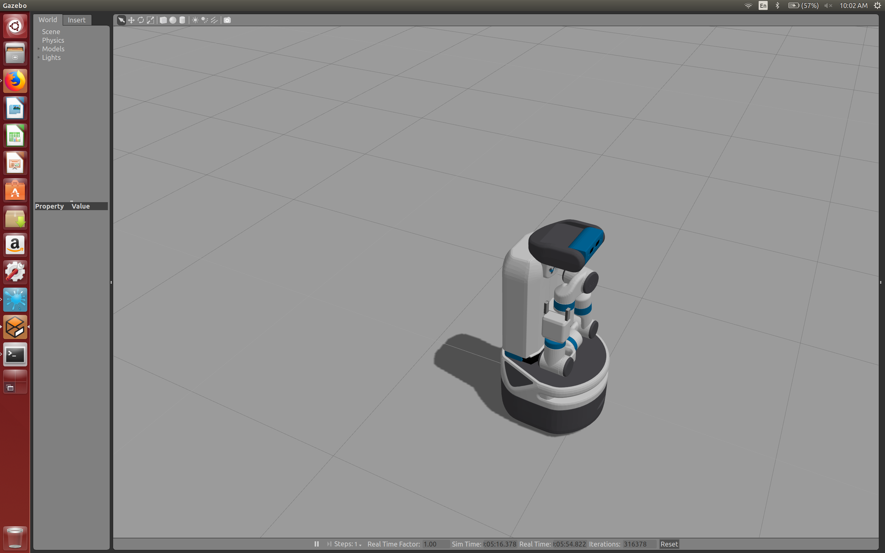
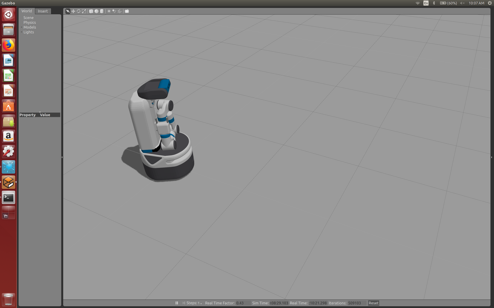
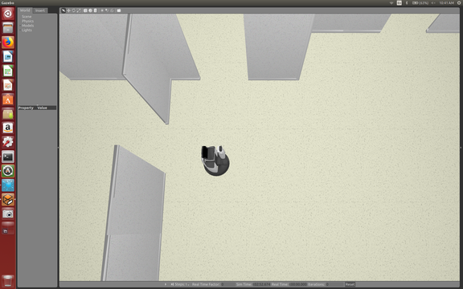
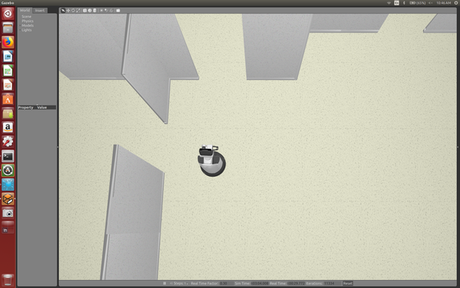
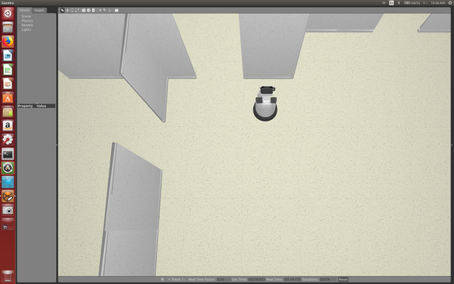
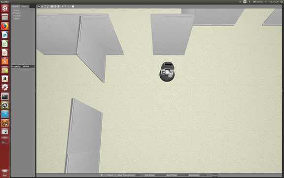

# Base

This lets us control the mobile portion of the robot.

Definition:

> **Odometry** is the use of data from motion sensors to estimate change in
> position over time. It is used in robotics by some legged or wheeled robots
> to estimate their position relative to a starting location.


## Fetch

See the docs for details: 

http://docs.fetchrobotics.com/api_overview.html#base-interface

It's not "action-based" so we won't see a list of ROS topics grouped into five
(cancel, goal, status, feedback, result) like we did with other code like the
gripper and torso.

Here's the starting position of the Fetch:



After moving forward 1 meter, at a speed of 0.1 meters/second:



(And by the way, speed here is in meters, time is in seconds, which is
standard.)

I reset the position to the start, and did the same, moving forward 1 meter.
This time, however, I decided to go 10 meters/second, a 100x speed increase.
This resulted in substantial overshooting:



(And I'm also sure the speed doesn't actually move that fast, it's got to be
truncated or limited somehow.)

Now back to the start position. Here's what it looks like after rotating 30
degrees:



It's clockwise *when looking top-down at the robot*. Same thing happens with the
head movement, as I observed.

You can also, of course, move both forward and rotate the base simultaneously,
using the correct forward and turning velocities. These are both single scalars,
presumably because we only care about going forward (so, one direction/axis) and
the rotation can only happen around one axis (basically, the coordinate frame
corresponds to the Fetch's body). So at least that part seems clear.

It might be easiest just to rotate first, then move forward, though.

The forward and turning methods (and there's two turning methods, using
different strategies) both call `move` in a loop, and that method adjusts the
linear velocity in the x direction and the angular velocity in the z direction.
It publishes via `geometry_msgs.msg.Twist` and that publishing is what moves the
robot. As the docs state:

> User applications will typically not connect directly to
> `base_controller/command`, but rather to `cmd_vel`

Incidentally, `/cmd_vel` is a ROS topic, as is `/odom`. We need these precise
topics in the publisher and subscriber, respectively, in order for this to work.


## HSR

For the HSR, we use the "omni base."  See `hsr_omni_base_tests.py` for details.

Start world:



```
At beginning, finished whole_body.move_to_go()
starting robot.start_pose: [-1.648e-06,  9.682e-07, 3.283e-06]
starting omni_base.pose:   [-4.155e-07, -2.997e-06, 3.108e-06]
    
calling omni_base.go_abs(0, 0, 1.57079632679, 300):
updated robot.start_pose: [-1.648e-06, 9.682e-07, 3.283e-06]
updated omni_base.pose:   [-8.109e-05, 0.000, 1.561]
    
calling omni_base.go_abs(1, 1, 1.57079632679, 300):
updated robot.start_pose: [-1.648e-06, 9.682e-07, 3.283e-06]
updated omni_base.pose:   [0.993, 0.995, 1.571]
    
calling omni_base.go_abs(1, 1, -1.57079632679, 300):
updated robot.start_pose: [-1.648e-06, 9.682e-07, 3.283e-06]
updated omni_base.pose:   [1.0004, 1.0004, -1.5800]
```

So, the `start_pose` (see `hsr_omni_base_tests.py` for details) stays *fixed*
even though the `omni_base.pose` keeps updating itself. First, we rotated 90
degrees (pi/2 radians):



Then moved to (1,1) while maintaining the rotation:



Then rotated -pi/2 radians.



It works as expected, and the angle here (which the HSR docs say as the angle
about the yaw axis) has the same semantics as the angle of the Fetch in our
turning code (see `base.py` for details).
