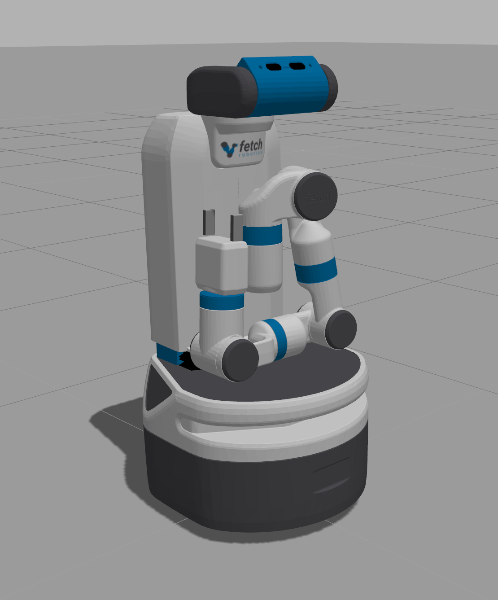
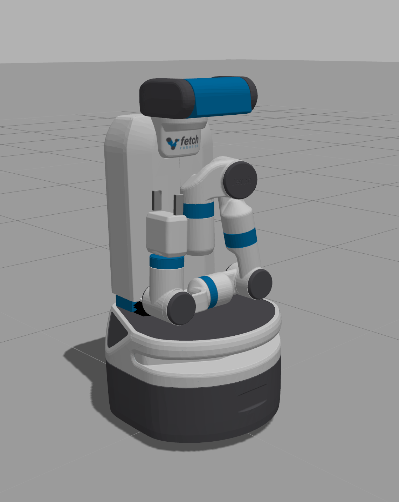
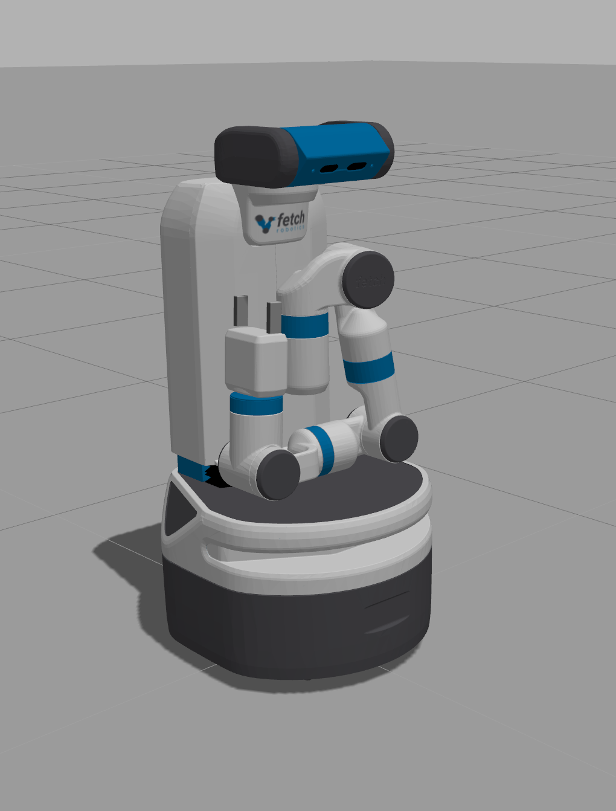

# Head

## Fetch

The head exposes two action interfaces as follows:

```
/head_controller/follow_joint_trajectory/cancel
/head_controller/follow_joint_trajectory/feedback
/head_controller/follow_joint_trajectory/goal
/head_controller/follow_joint_trajectory/result
/head_controller/follow_joint_trajectory/status
/head_controller/point_head/cancel
/head_controller/point_head/feedback
/head_controller/point_head/goal
/head_controller/point_head/result
/head_controller/point_head/status
```

As usual, the interfaces are grouped and have `{cancel, feedback, goal, result,
status}` topics.

It may be helpful to know the links and joints of the robot. [Here is an
overview of the mechanical design][1].

### "Looking At" Stuff

A few interesting observations.

- Starting position, which was obtained when we made the view go to (0,0,1).
  Makes sense. Then, after going to (0,0,0) we look down. Makes sense, again.

  First | Second
  :-------------------------:|:-------------------------:
    |  

- Then, after going to (0,1,0) the position looks exactly the same, so the y
  axis must be perpendicular to where the eyes are looking, it doesn't rotate. I
  didn't show this.

- Then, after going to (1,0,0) ah we get this. So the x-axis must be straight
  from the robot's view. Finally, looking at (10,0,0) the head becomes more
  level, makes sense as we're looking at a point further ahead.

  Third | Fourth
  :-------------------------:|:-------------------------:
    |  


It makes sense that the starting point is (0,0,0) though I'm not entirely sure
where to find this, it's not in the launch file.

This is all with respect to the `base_link` frame, the one that's at its base of course.


### "Pan Tilt" Stuff


## HSR

In progress ...


[1]:http://docs.fetchrobotics.com/robot_hardware.html
