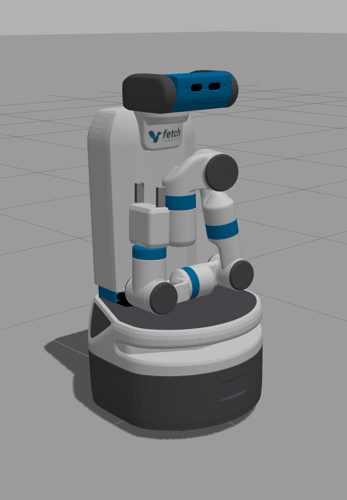

# Head

## Fetch

The head exposes two action interfaces as follows:

```
/head_controller/follow_joint_trajectory/cancel
/head_controller/follow_joint_trajectory/feedback
/head_controller/follow_joint_trajectory/goal
/head_controller/follow_joint_trajectory/result
/head_controller/follow_joint_trajectory/status
/head_controller/point_head/cancel
/head_controller/point_head/feedback
/head_controller/point_head/goal
/head_controller/point_head/result
/head_controller/point_head/status
```

As usual, the interfaces are grouped and have `{cancel, feedback, goal, result,
status}` topics.

It may be helpful to know the links and joints of the robot. [Here is an
overview of the mechanical design][1].

The code right now has two ways of moving the head, via "looking at" a point,
and via adjusting "pan and tilt."


### "Looking At" Stuff (Point Head)

A few interesting observations.

- Here's the starting position, which was obtained when I made the view go to
  (0,0,1).  Makes sense. Then, after going to (0,0,0) we look down. Makes sense,
  again. This is the `base_link` frame, the origin is at the bottom of the
  robot.

  First | Second
  :-------------------------:|:-------------------------:
    |  

- I then commanded the robot to look at (1,0,0), and get the next image here. So
  the x-axis must be straight ahead from the robot's view. Looking at (10,0,0),
  shown in the next image, the head becomes more level, makes sense as we're
  looking at a point "further ahead" from the perspective of the base link.

  Third | Fourth
  :-------------------------:|:-------------------------:
    |  

- Finally, let's have it look at points (10,-10,0) and then (10,10,0),
  respectively. The image below to the left thus implies that the negative
  y-direction is to the right of the robot with respect to its starting view.

  Fifth | Sixth
  :-------------------------:|:-------------------------:
    |  

It makes sense that the starting point is (0,0,0) though I'm not entirely sure
where to find this, it's not in the launch file.

This is all with respect to the `base_link` frame, the one that's at its base of
course. Here it is, highlighted in Gazebo:


I suppose we could have used this visual to figure out the three coordinates
(and which direction is positive, which should be the direction of the arrows)
but it's nice to confirm with head movements.


### "Pan Tilt" Stuff (Follow Joint Trajectory)

Here's an alternative way to move the head, with tuples (a,b) denoting pan and
tilt values, respectively. **Note that these are in radians** so presumably we
want values bounded in `(-2*pi, 2*pi)`, though I also think there are some extra
limits on what the joint angles can be, e.g. if `pi` is the limit in the
positive direction, anything between `(pi, 2*pi)` gets rounded down to `pi`?

- These are the results after setting the tuples to be (0,0) and (0,1),
  respectively. Makes sense, positive tilt is downwards.

  First | Second
  :-------------------------:|:-------------------------:
    |  

- Now I set it to be (0,-2) and (1,0), respectively. Again, makes sense,
  negative tilt is looking upwards, then later (with zero tilt) a positive pan
  is clockwise, though from a top-down aerial view.

  Third | Fourth
  :-------------------------:|:-------------------------:
    |  

It's not clear which one we should use in research code.


## HSR

In progress ...


[1]:http://docs.fetchrobotics.com/robot_hardware.html
